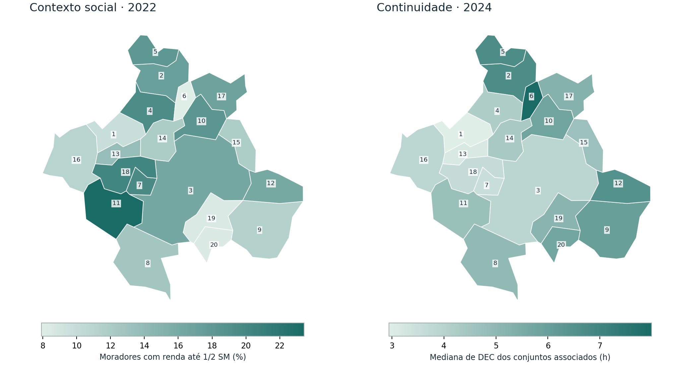

# Energia e Equidade — Região Metropolitana de Campinas

**Continuidade do fornecimento, desigualdade social e políticas públicas com dados abertos.**

Projeto pessoal de portfólio de Lucas Barros Ambrósio. Integra engenharia elétrica, análise territorial e discussão de políticas públicas. A implementação foi produzida com assistência de IA; o projeto não representa parceria institucional, intervenção executada ou responsabilidade técnica profissional.



## O que o projeto investiga

**Municípios com maior proporção de moradores de baixa renda estão associados a conjuntos elétricos com interrupções mais frequentes ou prolongadas?**

O estudo cobre 20 municípios, 56 conjuntos elétricos associados à região e os anos elétricos de 2022 a 2025. A referência social é o Censo 2022. O ano principal de associação é 2022; o panorama regional recente usa 2024 porque há três séries regionais incompletas em 2025 na fotografia obtida.

**Resultado principal:** a correlação descritiva entre baixa renda e mediana do DEC dos conjuntos associados em 2022 é próxima de zero (Spearman ρ = 0,032; 20 municípios). A relação muda conforme o ano e o filtro geográfico. Isso não permite concluir que não existe desigualdade entre moradores: conjuntos compartilhados e dados agregados limitam a inferência.

## Abra primeiro

- [Relatório técnico em PDF — 8 páginas](reports/Relatorio_Tecnico_Energia_Equidade.pdf).
- [Relatório interativo offline](reports/Observatorio_Energia_Equidade.html): baixe o projeto, extraia o ZIP e abra esse arquivo no navegador. A visualização de código do GitHub não executa o HTML.
- [Guia de estudo e apresentação](docs/GUIA_APRESENTACAO.md).

O relatório interativo contém mapa, seleção de ano e município, comparação com referências estadual e nacional, dispersão, diagnóstico de cobertura e exportação CSV. Não precisa de instalação, servidor, conta ou chave de API. No Windows, também é possível abrir `abrir_relatorio.bat` após extrair o pacote.

## Entregas técnicas

| Componente | Implementação |
|---|---|
| Aquisição | Fontes oficiais, cache, URL/data e SHA-256 |
| Engenharia de dados | Chaves consistentes, leitura em blocos, snapshot reproduzível, validação de cobertura |
| Indicadores | Reconstrução anual de DEC/FEC ajustada pelo número mensal de UCs |
| Território | Relação conjunto–município, mapas e auditoria de compartilhamento |
| Dimensão social | Renda média, mediana e proporção de moradores até 1/2 SM, incluindo sem rendimento |
| Análise | Spearman descritivo, retirada de um município, recorte exclusivo e coorte temporal fixa |
| SQL | Banco SQLite e consultas de inspeção |
| Qualidade | 16 testes de cálculo/validação e workflow de CI |
| Políticas públicas | Matriz de diagnóstico, serviços essenciais, transparência e participação |

## Reproduzir a análise

Ambiente validado: Python 3.12.14. As versões testadas estão em `requirements-tested.txt`. Para usar o ambiente isolado:

```bash
python -m venv .venv
```

No Windows PowerShell:

```powershell
.venv\Scripts\python.exe -m pip install -r requirements-tested.txt
.venv\Scripts\python.exe -m unittest discover -s tests -v
.venv\Scripts\python.exe -m energia_equidade.build
.venv\Scripts\python.exe -m energia_equidade.report
```

No Linux/macOS:

```bash
.venv/bin/python -m pip install -r requirements-tested.txt
.venv/bin/python -m unittest discover -s tests -v
.venv/bin/python -m energia_equidade.build
.venv/bin/python -m energia_equidade.report
```

A análise usa o snapshot incluído e funciona offline depois da instalação das dependências. O build produz CSVs e SQLite; o report gera PDF, HTML e figuras. A [validação automática no GitHub Actions](https://github.com/lucasambrosio1500/-energia-equidade-rmc-/actions) executa os testes e regenera a análise e os relatórios a cada envio.

Os arquivos auxiliares `limits.csv` e `crosswalk.csv` são distribuídos em gzip sem perda para reduzir o download. O build lê essas cópias diretamente; após uma atualização, dá preferência aos CSVs originais. Os hashes dos metadados `.source.json` referem-se aos bytes descompactados; `MANIFEST.sha256` registra os arquivos efetivamente publicados.

### Atualização das fontes

```bash
python -m energia_equidade.acquire --refresh
python -m energia_equidade.build --extract
python -m energia_equidade.report
```

Essa operação acessa ANEEL/IBGE e baixa também um arquivo nacional de cerca de 73 MB, cujo conteúdo descompactado é processado em blocos. Use alguns GB livres para trabalhar com folga. Sem `--extract`, o build preserva o snapshot mensal incluído. A atualização exige rever cobertura, datas e narrativa da edição antes de divulgá-la; texto de conclusão não deve ser reutilizado automaticamente se os dados mudarem.

## Limites que fazem parte do resultado

1. **Conjunto elétrico não é município.** 44 dos 56 conjuntos ativos associados à RMC atendem mais de um município. Sem número de UCs por interseção, a mediana territorial não é DEC municipal oficial.
2. **Renda é de 2022.** Comparações com anos posteriores usam contexto social fixo, não renda atualizada.
3. **Cadastro territorial é de 2026.** O vínculo aplicado a anos anteriores é uma aproximação; não há histórico de fronteiras validado.
4. **Não há inferência causal.** Dados compartilhados criam dependência. Não apresentamos p-valores nem regressão com controles insuficientes.
5. **Continuidade é parte da qualidade da energia.** Tensão, harmônicos, acesso, acessibilidade tarifária e efeitos sobre saúde ou produtividade não foram medidos.
6. **Ausências não são zeros.** Anos incompletos são excluídos da reconstrução e identificados nos diagnósticos. As referências Brasil/SP são estatísticas de conjuntos, não indicadores globais oficiais.

Consulte [metodologia completa](docs/METODOLOGIA.md), [dicionário de dados](docs/DICIONARIO_DADOS.md), [políticas públicas](docs/POLITICAS_PUBLICAS.md) e [consultas SQL](sql/consultas.sql).

## Fontes

- [ANEEL — DEC, FEC, NumCon e limites](https://dadosabertos.aneel.gov.br/dataset/indicadores-coletivos-de-continuidade-dec-e-fec).
- [ANEEL — IndQual Município](https://dadosabertos.aneel.gov.br/dataset/indqual-municipio).
- [IBGE/SIDRA — tabela 10295](https://sidra.ibge.gov.br/tabela/10295) e [tabela 10296](https://sidra.ibge.gov.br/tabela/10296).
- [IBGE — APIs de localidades e malhas](https://servicodados.ibge.gov.br/api/docs/).
- [AGEMCAMP — composição regional](https://dadosabertos.sp.gov.br/organization/about/agencia-metropolitana-de-campinas-agemcamp).

Metadados oficiais, URLs de aquisição, hashes e versão da fotografia acompanham `data/`. O ZIP nacional bruto é readquirível e não integra o repositório. O snapshot filtrado contém 450.359 registros mensais; 8.061 são de conjuntos associados à RMC. Dados não provêm de sistemas internos da Neoenergia Elektro ou de outras empresas.

## Próxima etapa substantiva

Obter histórico de vínculos e consumidores por interseção, dados de interrupções localizados e cargas críticas. Validar o diagnóstico com conhecimento local. Só depois avançar para priorização de investimentos ou avaliação de impacto de intervenções.

## Licenças e atribuição

Código original: [MIT](LICENSE). Dados da ANEEL e base derivada: observar [licenças e atribuições dos dados](data/LICENSE.md), incluindo ODbL 1.0. A licença do código não substitui a licença das bases. Cite sempre ANEEL e IBGE e a data da fotografia. Logos oficiais não são utilizados.
